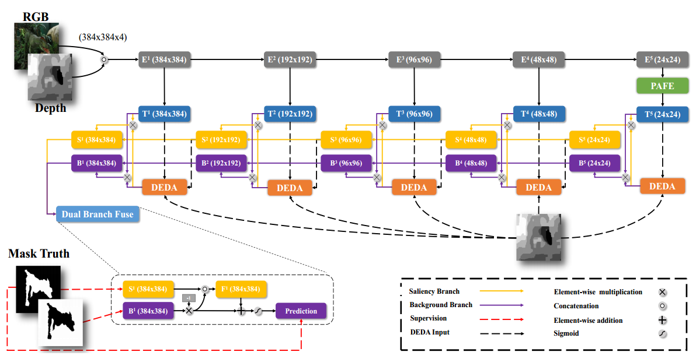
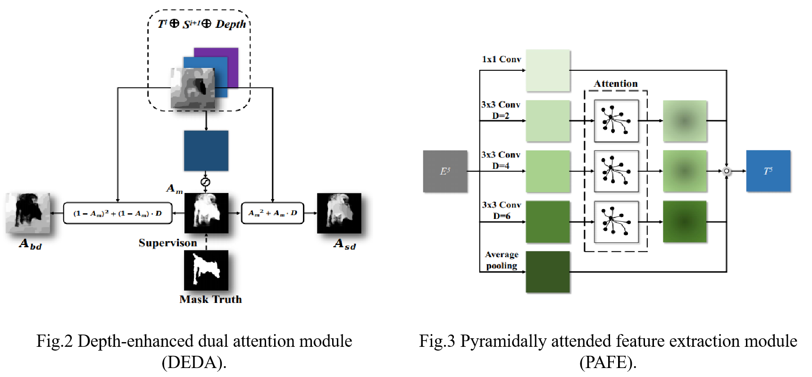
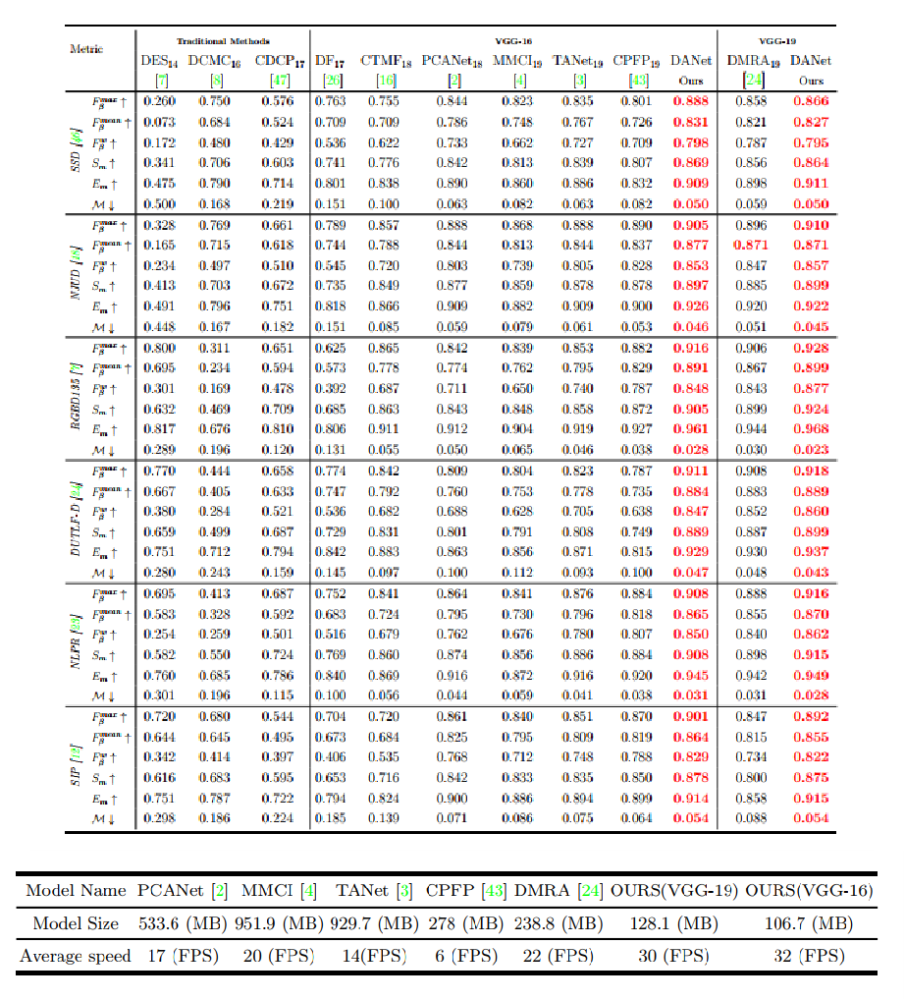
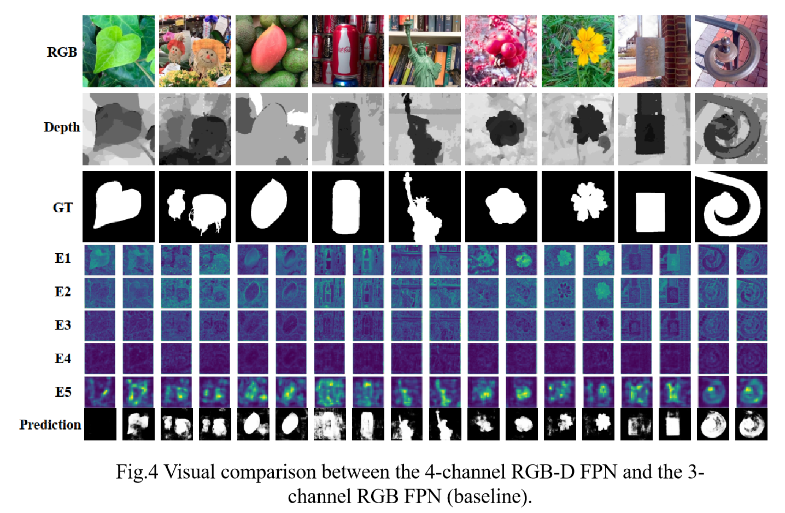
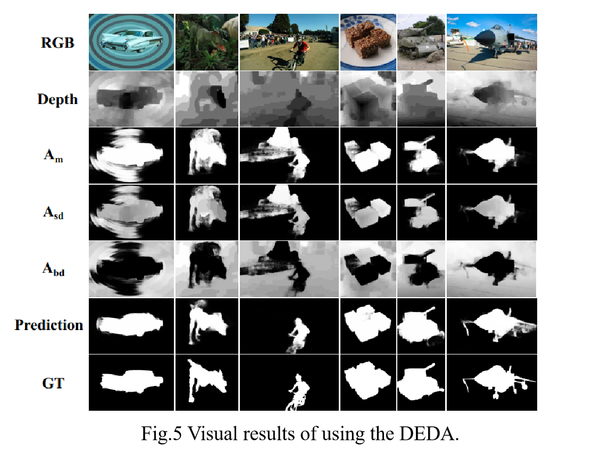

# DANet-RGBD-Saliency
(ECCV 2020) A Single Stream Network for Robust and Real-time RGB-D Salient Object Detection  
https://arxiv.org/pdf/2007.06811.pdf  
As we are currently using our algorithm in a related competition, we will release the code around November. (Both DANet and GateNet) 
## Saliency map
[BaiduYunPan(3m9i)](https://pan.baidu.com/s/1_sOsCOgZwFNtPdXypFJHog)  
## Related Works
* (ECCV 2020 Oral) Suppress and Balance: A Simple Gated Network for Salient Object Detection: https://github.com/Xiaoqi-Zhao-DLUT/GateNet-RGB-Saliency
* (ECCV 2020) Hierarchical Dynamic Filtering Network for RGB-D Salient Object Detection: https://github.com/lartpang/HDFNet
* (CVPR 2020) Multi-scale Interactive Network for Salient Object Detection: https://github.com/lartpang/MINet

## Network


## Module


## Quantitative comparison


## Visual comparison


  

## Trained Model
You can download the trained VGG16-model(DUT-RGBD or NJUD&NLPR) at [BaiduYunPan(5uhd)](https://pan.baidu.com/s/1XJziVUSlRynU_yUHA86cpg).
## Requirement
* Python 3.7
* PyTorch 1.5.0
* torchvision
* numpy
* Pillow
* Cython
## Training
1.Set the path of training sets in config.py  
2.Run train.py
## Testing
1.Set the path of testing sets in config.py    
2.Run generate_salmap.py (can generate the predicted saliency maps)  
3.Run generate_visfeamaps.py (can visualize feature maps)  
4.Run test_metric_score.py (can evaluate the predicted saliency maps in terms of fmax,fmean,wfm,sm,em,mae). You also can use the toolkit released by us:https://github.com/lartpang/Py-SOD-VOS-EvalToolkit.

## BibTex
```
@inproceedings{DANet,
  title={A Single Stream Network for Robust and Real-time RGB-D Salient Object Detection},
  author={Zhao, Xiaoqi and Zhang, Lihe and Pang, Youwei and Lu, Huchuan and Zhang, Lei},
  booktitle=ECCV,
  year={2020}
}
```
