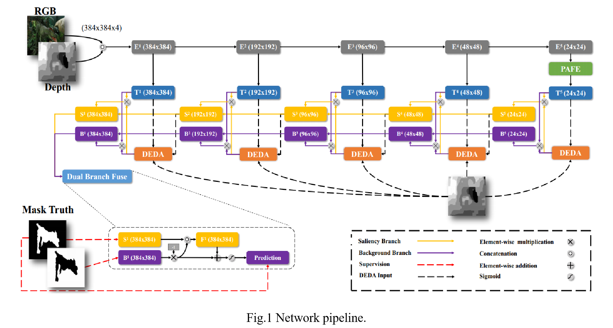

# DANet-RGBD-Saliency
(ECCV 2020) A Single Stream Network for Robust and Real-time RGB-D Salient Object Detection  
Our code will be released soon.
## Related Works
* (ECCV 2020 Oral) Suppress and Balance: A Simple Gated Network for Salient Object Detection: https://github.com/Xiaoqi-Zhao-DLUT/GateNet-RGB-Saliency
* (ECCV 2020) Hierarchical Dynamic Filtering Network for RGB-D Salient Object Detection: https://github.com/lartpang/HDFNet
* (CVPR 2020) Multi-scale Interactive Network for Salient Object Detection: https://github.com/lartpang/MINet
## Network

 

## Module

 

## Quantitative comparison

 

## Visual comparison

 

 

